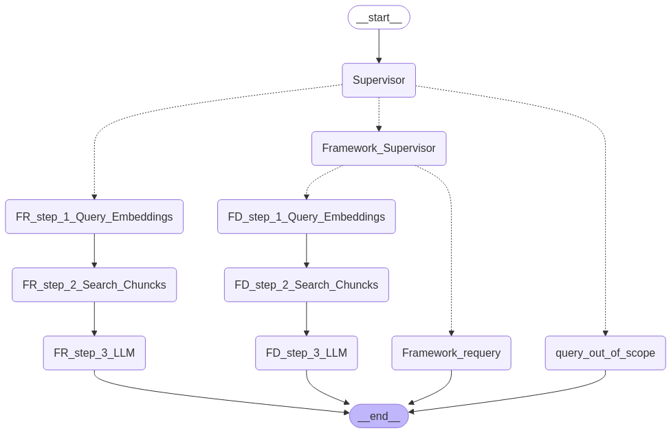

# ccs-ai-bot-web-intelligent-search

# Intelligent Semantic Search Prototype for CCS Frameworks

## Problem Statement

The current corporate website relies on a keyword-based Elastic Search system integrated with the WordPress CMS. This method often fails to return relevant or meaningful results, especially for complex or natural language queries. Compounding this, the Guided Match tool—designed to assist users in search—has poor usability and low adoption.

As a result, users struggle to locate framework agreements and services effectively, leading to a high number of “how do I…” queries directed to the Customer Service Centre (CSC). These avoidable contacts increase operational costs and decrease the efficiency of self-service.

---

## Objective

To address these challenges, the objective is to:

- Replace keyword-based search with **semantic understanding**.
- Reduce avoidable CSC contacts by **5%** by improving the relevance and accuracy of information retrieval.
- Improve **user experience** by minimizing search effort and frustration.

---

## Solution: Intelligent Search Prototype

This project is a **web-based pilot** implementing an **intelligent semantic search system** capable of understanding and responding to natural language queries related to the Crown Commercial Service (CCS) frameworks.

Built using **LangGraph**, the system features a **multi-RAG agent architecture** capable of:

- Recommending the most relevant frameworks based on user queries.
- Answering detailed questions related to the **top 5 CCS frameworks** using semantic reasoning.

---

## Supported Frameworks

1. **Digital Outcomes (DOS) / G-Cloud 14**
   - Note: This crosses over into the CAS platform once Lot information is selected.
2. **Technology Products & Associated Services 2**
3. **Management Consultancy Framework (MCF3)**
4. **Network Services 3**
5. **Facility Management and Workplace Services DPS**

---

## System Architecture

The intelligent search is implemented using a **multi-agent Retrieval-Augmented Generation (RAG) architecture** powered by [LangGraph](https://docs.langchain.com/langgraph/).

### Key Components:

- **Supervisor Node**: Determines query intent and routes it.
- **Framework Supervisor**: Handles framework-specific logic.
- **Embedding & Search Stages**:
  - Query is embedded using `text-ada-002`.
  - Relevant chunks retrieved from **Azure Cognitive Search (Vector DB)**.
- **LLM Response Generation**: Uses **GPT-4o** for natural language understanding and generation.
- **Fallbacks**:
  - Handles requery and out-of-scope detection.

 <!-- Update path to actual image if hosted -->

---

## Technologies Used

| Tool/Service                | Purpose                                |
|----------------------------|----------------------------------------|
| **LangGraph**              | Agent orchestration & workflow control |
| **GPT-4o**                 | LLM for intelligent response generation|
| **text-ada-002**           | Embedding model for semantic search    |
| **Azure Cognitive Search** | Vector DB for storing document chunks  |
| **Python**                 | Core development language              |       |

---

## Expected Impact

- Decrease CSC contact rate by **5%**.
- Improve user satisfaction and reduce bounce rate.
- Accelerate user ability to self-serve with minimal frustration.

---

## 🚀 Deployment
The webapp and API are deployed in the Azure.
- 🌐 Web App URL (e.g., https://webpilot-v1-gbchgrbdecgfgyhj.uksouth-01.azurewebsites.net)
- 🔗 API Endpoint URL (e.g., https://azd-uks-ai-webpilot-intelligentsearch-api-a3ewg3deabbmasab.uksouth-01.azurewebsites.net/search)
---

